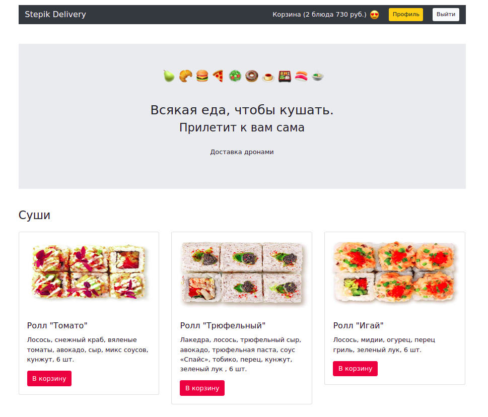
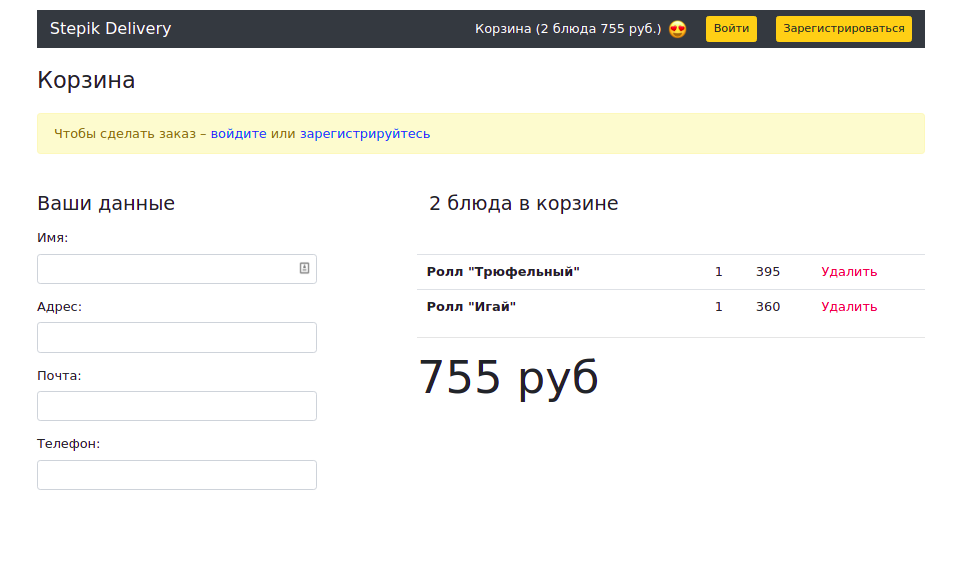
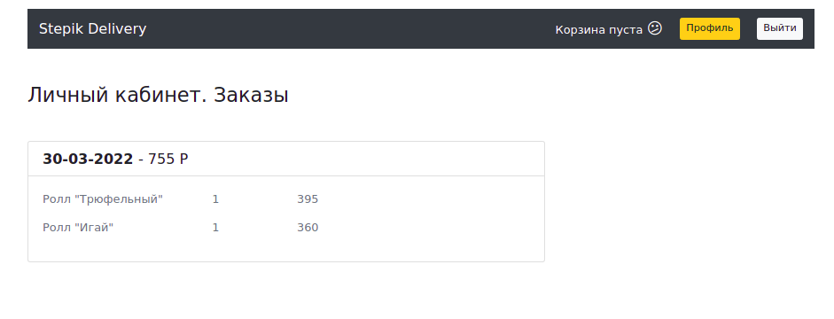
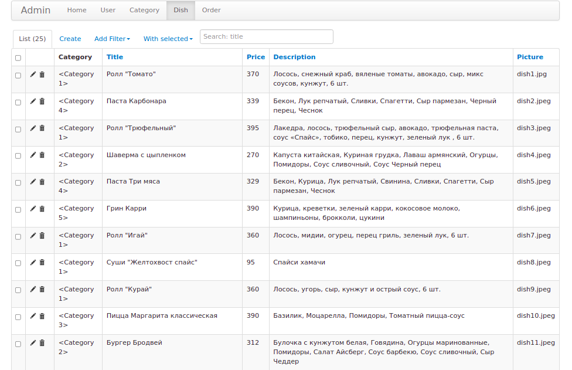

# flask_stepik_3

### Описание

Cервис доставки еды.
В проекте реализована работа с шаблонами, базой данных, сессиями (аутентификация и авторизация)


### Технологии

Python      
Flask       
SQLAlchemy      
PostrgeSQL      

### Запуск проекта

- Склонируйте репозиторий:

```
git clone https://github.com/AlexeyPeresypkin/flask_stepik_3.git
```
Cоздайте и активируйте виртуальное окружение:

```
python -m venv venv
```
```
source venv/bin/activate 
```
Обновите pip и установите зависимости:
```
python -m pip install --upgrade pip
pip install -r requirements.txt
```
Создайте в папке приложения файл .env со следующими переменными:
```
DATABASE_URL=postgresql://<login>:<password>@127.0.0.1:5432/<psql_db_name>
APP_SECRET_KEY=my-super-secret-phrase-I-dont-tell-this-to-nobody
```
Создайте таблицы в базе данных:
```
python db_create.py
```
Наполните по необходимости базу данных данными:
```
sudo -u postgres psql -d <db_name> -f db_backup.dump
```
Запустите приложение
```
python run.py
```







